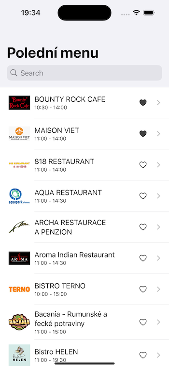
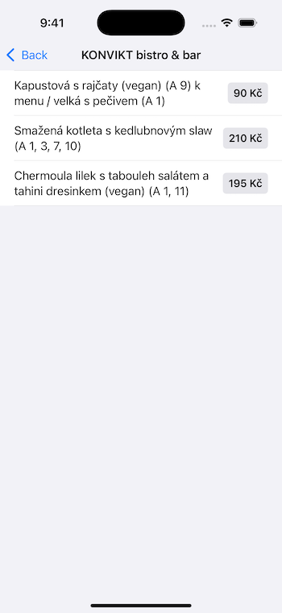

# Menu Olomouc

Simple helper app that fetches local lunch menu specials in my home city Olomouc. Aggregator site [olomouc.cz](https://www.olomouc.cz/poledni-menu/) does not expose API, so app has to fetch HTML page, parse DOM and show results in a digestible way. On top of plain display, there is possibility to search and favorite places.

Project was created for personal usage.

## Tech

- Swift 5 with strict concurrency checking
- SwiftUI and Combine
- [Kanna](https://github.com/tid-kijyun/Kanna) package for HTML parsing
- [Factory](https://github.com/hmlongco/Factory) package for DI
- Fastlane for running configured `swiftlint` and `swiftformat`
- `automatic` code signing setup because of personal nature of the project
- basic unit tests for HTTP fetcher and HTML parser

## Preview

 
